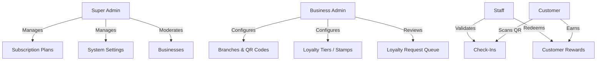
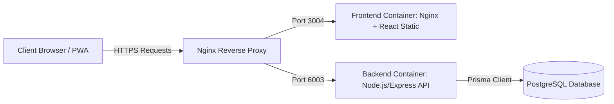

# Product Requirements Document (PRD)
## Project: ScanLoyal (by LogiSaar) — Digital Loyalty Voucher SaaS
**Author:** Senior Staff Solutions Architect & Principal Product Engineer  
**Version:** 1.0.0 (Production-Ready Spec)  
**Status:** Approved  

---

## 1. Executive Summary & Vision

### 1.1 Product Definition
**ScanLoyal** is a next-generation, multi-tenant mobile-first Software-as-a-Service (SaaS) digital loyalty and customer retention platform. It enables brick-and-mortar merchants (retail, dining, service brands) to instantly create, deploy, and manage digital check-in stamp cards, custom loyalty levels, and dynamic reward vouchers. 

By eliminating the friction of installing native mobile apps, ScanLoyal leverages standard mobile web browsers, GPS geolocation verification, signed HMAC-SHA256 QR codes, and native service worker notifications to create a seamless, app-like customer loyalty loop.

### 1.2 Key Value Propositions
*   **Zero-Friction for Customers**: No app store downloads required. Customers scan a branch QR code to register/log in via quick OTP, verify their location, and instantly check in to earn stamps or request loyalty points.
*   **Geofenced Fraud Prevention**: Solves the classic "photo-of-a-QR-code-from-home" fraud vector by validating the customer's real-time GPS coordinates against the physical branch coordinates on the server using the Haversine formula.
*   **Dynamic Custom Tiering**: Offers merchants two engines:
    1.  *Visit-Based Stamp Cards*: Visual grid of stamp slots modeled after traditional physical cards (with custom stamps).
    2.  *Points-Based Manual Approval Levels*: Allows businesses to define custom loyalty tiers (e.g., Bronze, Gold, Platinum) and manually award custom points per check-in through an in-app queue.
*   **App-Like Engagement**: Integrates a Paytm-style laser camera scanner overlay, custom central **LS** (LogiSaar) logo badges on QR codes, and native mobile notification bar alerts driven by service workers.

---

## 2. User Personas & Roles



### 2.1 Super Admin (Platform Owner)
*   **Role**: Platform administrator with full visibility into the global system tenant state.
*   **Goal**: Monitor platform health, manage subscription plans, review system settings, moderate merchant accounts, inspect audit trails, and manage fraud triggers.
*   **Key Needs**: Dashboard analytics showing platform-wide check-ins, active businesses, active subscriptions, monthly revenue, fraud rates, and direct user notification broad-casting.

### 2.2 Business Admin (Merchant Owner)
*   **Role**: The business tenant owner who registers their brand, configures loyalty programs, and monitors analytics.
*   **Goal**: Drive repeat visits, manage outlet branches, configure custom loyalty levels, review pending check-in requests, and analyze branch performance.
*   **Key Needs**: Self-serve subscription management, multi-branch QR code generation with printable PDF poster layout, clear loyalty program builders, and real-time request approval dashboards.

### 2.3 Staff (Merchant Store Employee)
*   **Role**: Front-line store employees who interface directly with customers at check-out.
*   **Goal**: Verify suspicious check-ins, record physical visits, and process reward redemptions.
*   **Key Needs**: Simplified mobile views, rapid toggle of check-in statuses, and redemption code validator interfaces.

### 2.4 Customer (End-User / Consumer)
*   **Role**: The end-consumer shopping at participating merchant outlets.
*   **Goal**: Collect stamps/points and unlock rewards without downloading bloated native applications.
*   **Key Needs**: Fast OTP login, a responsive mobile web interface, interactive visit stamp cards, location check-in triggers, social media connectivity to brands, and automatic push notifications on their phone's notification bar when points are approved or rewards are unlocked.

---

## 3. Product Features & Technical Specifications

---

### 3.1 Self-Serve Merchant Registration & Billing (Subscription Engine)
*   **Sign-Up Flow**: Merchants register by entering user details (Name, Email, Phone, Password) and business details (Business Name, Address). Upon registration, the business account status is marked as `PENDING` until activated by subscription purchase.
*   **Payment Gateway Integration**: Direct integration with **Razorpay**. 
*   **Launch Year Special Plan**: Default subscription pricing model displays crossed-out pricing **~~₹3,500~~** followed by **₹999** for the yearly subscription, supporting up to **8,000 customers** and unlimited check-ins.
*   **Dynamic Tax & Charge Handling**: Behind-the-scenes, payment calculations automatically apply tax percentages and gateway charges (e.g. Gateway Charges 2.3%, GST 5%) retrieved dynamically from system settings, while presenting a clean, user-friendly breakdown on the frontend.
*   **Grace Periods**: Automated grace period (7 days) after a payment failure before suspending the business account.
*   **Auto-Suspension Cascade**: If a business is suspended, all associated staff logins are locked, QR code scanning endpoints return forbidden states, and customer check-ins are blocked.

---

### 3.2 Geofenced QR Code Check-In & Anti-Fraud Engine
*   **Signed QR Tokens**: Each branch has a unique signed QR token containing the branch ID and a timestamp, cryptographically signed using an `HMAC-SHA256` key. This prevents spoofing or pre-generating fake scan URLs.
*   **Printable PDF Posters**: Generates an A4-sized printable PDF poster in the merchant portal containing the branch name, address, instructions, and the check-in QR code featuring a custom central **LS** logo overlay.
*   **GPS Validation (Server-Side)**: When a customer scans the QR code, the client web app requests browser geolocational coordinates. The API computes the distance between the customer's coordinates and the branch coordinates using the **Haversine Formula**:
    $$d = 2R \arcsin\left(\sqrt{\sin^2\left(\frac{\Delta \phi}{2}\right) + \cos(\phi_1)\cos(\phi_2)\sin^2\left(\frac{\Delta \lambda}{2}\right)}\right)$$
    If the calculated distance exceeds the branch `radiusMeters` limit (default 50-100m), the check-in is logged as `SUSPICIOUS`.
*   **Anti-Fraud Controls**:
    *   *Scan Cooldowns*: Enforces a configurable cooldown period (default 4 hours) per customer per business to prevent rapid double-scanning.
    *   *Device Fingerprinting*: Generates a client UUID stored in browser `localStorage` combined with IP checking to prevent multi-device account sharing or emulator abuse.
    *   *Auditing*: Automated log generation in `audit_logs` for `CHECK_IN_SUSPICIOUS` events with full IP and coordinate metadata.

---

### 3.3 Visit-Based Stamp Cards & Custom Stamps
*   **Visual Board**: Displays an interactive grid (e.g., 8-stamp card) inside the customer dashboard.
*   **Lucide Stamp Icons**: Instead of generic stars, stamp points are represented by standard high-fidelity `Stamp` icons with backdrop blur effects.
*   **Reset Modes**:
    *   *Full Reset*: Resets the stamp board to `0` once the threshold is met and a reward is issued.
    *   *Carry Remainder*: Extra check-ins carry over to the next stamp card board.

---

### 3.4 Manual Loyalty Level Approval System
*   **Custom Tiers**: Business admins can create custom loyalty tiers (e.g., Bronze = +1 point, Gold = +5 points, Platinum = +10 points) with custom naming, point values, and sort orders.
*   **Loyalty Request Queue**: When a customer checks in, a pending `LoyaltyRequest` is created.
*   **Admin Approval Interface**: Business admins have a dedicated approvals dashboard showing customer names, check-in history, location details, and a level selection dropdown. The admin reviews the request, selects the appropriate loyalty tier, and clicks **Approve** or **Reject**.
*   **Point Transaction Ledger**: Approved requests trigger an immutable record in the `loyalty_transactions` ledger and award the corresponding points to the customer's wallet balance.

---

### 3.5 Native Mobile Notification Alerts
*   **Service Worker Architecture**: Registered service worker (`sw.js`) with cache bypass configured in `index.html` to eliminate browser loading issues during Vite bundle hash updates.
*   **Polling-Notification Sync**: A lightweight background polling service in the layout checks for unread alerts (such as `REWARD_UNLOCKED` or point approvals) in the database and triggers the browser's native `Notification` API.
*   **Mobile Notification Bar Integration**: If permissions are granted, notifications show up on the phone's native lock screen or system status bar with vibration feedback, linking directly back to the app when clicked.

---

### 3.6 Social Media Connect integrations
*   **Connect Links**: Merchants can configure Instagram profile links, Facebook pages, WhatsApp contacts (numbers or links), and Google Review links in their business profile.
*   **Dynamic Wallet Display**: The customer dashboard renders these links dynamically as premium styled rounded badges below their digital loyalty card. If a link is empty, the badge is automatically hidden from view.
*   **Click Tracking**: Direct links enable customers to leave quick reviews or connect on social media after scanning their QR code.

---

### 3.7 Paytm-Style Camera Scanner UI
*   **Target Frame Viewport**: A centered `192px x 192px` viewport with a dark backdrop shadow overlay (`shadow-[0_0_0_9999px_rgba(7,18,42,0.65)]`) that dims the rest of the camera field.
*   **Emerald Brackets**: Four thick glowing green corners outlining the scan target window.
*   **Animated Laser Sweep**: A horizontal glowing green laser line that continuously sweeps vertically inside the scanning frame to emulate high-end professional hardware scanners.

---

## 4. Technical Architecture & Component Design



### 4.1 Tech Stack
*   **Frontend**: React (SPA), Vite, TailwindCSS (for utility layout structure), Lucide Icons, and React Query (`@tanstack/react-query`) for state synchronization and cache management.
*   **Backend**: Node.js, Express, Prisma ORM, Multer (file upload), PDFKit (PDF generation), and Argon2 (secure password hashing).
*   **Database**: PostgreSQL 16 (relational database).
*   **Containerization**: Docker & Docker Compose orchestrating the multi-container stack.
*   **Reverse Proxy**: Nginx installed on the host system terminating SSL (via Let's Encrypt Certbot) and routing traffic to the Docker ports.

---

## 5. Database Schema Design (Prisma)

### 5.1 User & Auth Models
```prisma
enum Role {
  SUPER_ADMIN
  BUSINESS_ADMIN
  STAFF
  CUSTOMER
}

model User {
  id           String    @id @default(cuid())
  name         String
  phone        String    @unique
  email        String?   @unique
  passwordHash String?
  role         Role      @default(CUSTOMER)
  isActive     Boolean   @default(true)
  deletedAt    DateTime?
  createdAt    DateTime  @default(now())
  updatedAt    DateTime  @updatedAt
}
```

### 5.2 Business & Branch Models
```prisma
enum BusinessStatus {
  PENDING
  ACTIVE
  SUSPENDED
  PAST_DUE
  DELETED
}

model Business {
  id              String         @id @default(cuid())
  name            String
  logoUrl         String?
  phone           String?
  address         String?
  timezone        String         @default("Asia/Kolkata")
  status          BusinessStatus @default(ACTIVE)
  deletedAt       DateTime?
  instagramUrl    String?
  facebookUrl     String?
  whatsappUrl     String?
  googleReviewUrl String?
  ownerId         String
  planId          String?
  createdAt       DateTime       @default(now())
  updatedAt       DateTime       @updatedAt
}

model Branch {
  id           String   @id @default(cuid())
  name         String
  address      String?
  latitude     Float
  longitude    Float
  radiusMeters Int      @default(100)
  qrToken      String   @unique
  isActive     Boolean  @default(true)
  businessId   String
  createdAt    DateTime @default(now())
  updatedAt    DateTime @updatedAt
}
```

### 5.3 Loyalty, Request & Transaction Models
```prisma
enum LoyaltyRequestStatus {
  PENDING
  APPROVED
  REJECTED
}

model LoyaltyLevel {
  id          String   @id @default(cuid())
  name        String
  description String?
  points      Int
  sortOrder   Int      @default(0)
  businessId  String
  createdAt   DateTime @default(now())
  updatedAt   DateTime @updatedAt
}

model LoyaltyRequest {
  id           String               @id @default(cuid())
  status       LoyaltyRequestStatus @default(PENDING)
  customerId   String
  businessId   String
  checkInId    String?
  levelId      String?
  approvedById String?
  approvedAt   DateTime?
  createdAt    DateTime             @default(now())
}

model LoyaltyTransaction {
  id         String   @id @default(cuid())
  points     Int
  customerId String
  businessId String
  levelId    String?
  requestId  String?  @unique
  createdAt  DateTime @default(now())
}
```

---

## 6. Non-Functional Requirements

### 6.1 Security & GDPR Compliance
*   **GDPR Soft Deletion**: Customer profiles are soft-deleted via `deletedAt` timestamps. Associated analytics counts are anonymized.
*   **Cryptographic Tokens**: Branch QR codes utilize HMAC-SHA256 signature tokens. URL parameters cannot be altered by users to spoof location scans.
*   **Sensitive Data Protection**: Passwords hashed with Argon2. Refresh tokens are hashed using SHA-256 before storage in the database to prevent session hijacking.
*   **HTTPS Only**: Nginx blocks non-SSL traffic and forces redirects from HTTP port 80 to HTTPs port 443 with strong SSL protocols (TLSv1.2, TLSv1.3).

### 6.2 Rate Limiting & Performance
*   **API Rate Limiting**: Enforced rate limit zones for API endpoints (e.g. max 30 requests/sec globally, and strict limits on auth/OTP routes - max 5 logins per 15 minutes, max 3 OTP requests per 10 minutes).
*   **Nginx File Compression**: Gzip compression enabled for static assets to reduce bandwidth.
*   **Database Indexes**: Built-in composite database indexes on critical fields:
    *   `CheckIn(customerId, branchId)`
    *   `CheckIn(customerId, createdAt)`
    *   `LoyaltyRequest(businessId, status)`
    *   `RefreshToken(tokenHash)`

---

## 7. Future Scalability Roadmap

### 7.1 Redis Caching & OTP Management
*   Migrate short-lived data structures like OTP verification codes and refresh token sessions from PostgreSQL to a Redis cluster, reducing disk I/O on the primary relational database.

### 7.2 SMS Gateway Integrations
*   Move away from the `stub` developer SMS mode to live integrations with international providers like **Twilio** or regional providers like **MSG91** for instant OTP deliverability.

### 7.3 Advanced Geofencing Indexing
*   Implement spatial database extensions like **PostGIS** to perform native database-level location queries for businesses running thousands of outlet branches globally.
