# Database Schema Overview

The Digital Loyalty Voucher SaaS database uses **PostgreSQL** and is managed via **Prisma ORM**. 
There are a total of **31 tables** (models) created in the database.

## Table List (31 Tables)

1. **User**
2. **Business**
3. **SystemSetting**
4. **Branch**
5. **Staff**
6. **Plan**
7. **Subscription**
8. **Payment**
9. **CheckIn**
10. **LoyaltyProgram**
11. **Reward**
12. **CustomerReward**
13. **Coupon**
14. **CouponUsage**
15. **ClaimedCoupon**
16. **CustomerPoints**
17. **Notification**
18. **AuditLog**
19. **OtpVerification**
20. **RefreshToken**
21. **LoyaltyLevel**
22. **LoyaltyRequest**
23. **LoyaltyTransaction**
24. **BusinessReviewSettings**
25. **ReviewGeneration**
26. **PushSubscription**
27. **LoyaltyProgramSettings**
28. **UserWallet**
29. **WalletTransaction**
30. **LoyaltyPointsLedger**
31. **CustomerLoyaltyWallet**

## Entity Relationship Diagram (Mermaid)

Below is the Mermaid ER diagram showing how these tables are connected.

```mermaid
erDiagram
    User ||--o{ Business : "owns"
    User ||--o| Staff : "is (staffProfile)"
    User ||--o{ CustomerPoints : "has"
    User ||--o{ CheckIn : "performs"
    User ||--o{ CustomerReward : "earns"
    User ||--o{ Notification : "receives"
    User ||--o{ AuditLog : "triggers"
    User ||--o{ OtpVerification : "has"
    User ||--o{ RefreshToken : "has"
    User ||--o{ LoyaltyRequest : "requests"
    User ||--o{ LoyaltyTransaction : "has"
    User ||--o{ ReviewGeneration : "generates"
    User ||--o{ PushSubscription : "has"
    User ||--o{ UserWallet : "owns"
    User ||--o{ WalletTransaction : "has"
    User ||--o{ CustomerLoyaltyWallet : "owns"
    User ||--o{ LoyaltyPointsLedger : "has"
    User ||--o{ ClaimedCoupon : "claims"
    
    Business }|--|| User : "owner"
    Business }o--o| Plan : "subscribed to"
    Business ||--o| Subscription : "has"
    Business ||--o{ Branch : "has"
    Business ||--o{ Staff : "employs"
    Business ||--o{ LoyaltyProgram : "offers"
    Business ||--o{ Reward : "offers"
    Business ||--o{ Coupon : "issues"
    Business ||--o{ CustomerPoints : "tracks"
    Business ||--o{ CheckIn : "receives"
    Business ||--o{ Notification : "sends"
    Business ||--o{ LoyaltyLevel : "defines"
    Business ||--o{ LoyaltyRequest : "receives"
    Business ||--o{ LoyaltyTransaction : "processes"
    Business ||--o| BusinessReviewSettings : "has"
    Business ||--o{ ReviewGeneration : "has"
    Business ||--o| LoyaltyProgramSettings : "has"
    Business ||--o{ UserWallet : "manages"
    Business ||--o{ WalletTransaction : "manages"
    Business ||--o{ CustomerLoyaltyWallet : "manages"
    Business ||--o{ LoyaltyPointsLedger : "manages"

    Branch }|--|| Business : "belongs to"
    Branch ||--o{ Staff : "has"
    Branch ||--o{ CheckIn : "receives"

    Staff ||--|| User : "is"
    Staff }|--|| Business : "works for"
    Staff }o--o| Branch : "assigned to"
    Staff ||--o{ CustomerReward : "redeems"

    Plan ||--o{ Business : "used by"
    Plan ||--o{ Subscription : "has"

    Subscription ||--|| Business : "belongs to"
    Subscription }|--|| Plan : "based on"
    Subscription ||--o{ Payment : "has"

    Payment }|--|| Subscription : "pays for"

    CheckIn }|--|| User : "by customer"
    CheckIn }|--|| Business : "at"
    CheckIn }|--|| Branch : "at"

    LoyaltyProgram }|--|| Business : "belongs to"
    LoyaltyProgram }|--|| Reward : "gives"

    Reward }|--|| Business : "belongs to"
    Reward ||--o{ LoyaltyProgram : "used in"
    Reward ||--o{ CustomerReward : "granted as"

    CustomerReward }|--|| User : "owned by"
    CustomerReward }|--|| Reward : "is"
    CustomerReward }o--o| Staff : "redeemed by"

    Coupon }|--|| Business : "issued by"
    Coupon ||--o{ CouponUsage : "has"
    Coupon ||--o{ ClaimedCoupon : "claimed as"

    CouponUsage }|--|| Coupon : "uses"

    ClaimedCoupon }|--|| Coupon : "claims"
    ClaimedCoupon }|--|| User : "claimed by"

    CustomerPoints }|--|| User : "belongs to"
    CustomerPoints }|--|| Business : "at"

    Notification }|--|| User : "for"
    Notification }o--o| Business : "related to"

    AuditLog }o--o| User : "by"

    OtpVerification }o--o| User : "for"

    RefreshToken }|--|| User : "for"

    LoyaltyLevel }|--|| Business : "belongs to"
    LoyaltyLevel ||--o{ LoyaltyRequest : "requested"
    LoyaltyLevel ||--o{ LoyaltyTransaction : "awarded"

    LoyaltyRequest }|--|| User : "by"
    LoyaltyRequest }|--|| Business : "to"
    LoyaltyRequest }o--o| LoyaltyLevel : "for"
    LoyaltyRequest ||--o| LoyaltyTransaction : "results in"

    LoyaltyTransaction }|--|| User : "for"
    LoyaltyTransaction }|--|| Business : "at"
    LoyaltyTransaction }o--o| LoyaltyLevel : "for"
    LoyaltyTransaction ||--o| LoyaltyRequest : "from"

    BusinessReviewSettings ||--|| Business : "belongs to"

    ReviewGeneration }|--|| User : "by"
    ReviewGeneration }|--|| Business : "for"

    PushSubscription }|--|| User : "belongs to"

    LoyaltyProgramSettings ||--|| Business : "belongs to"

    UserWallet }|--|| User : "belongs to"
    UserWallet }|--|| Business : "at"

    WalletTransaction }|--|| User : "for"
    WalletTransaction }|--|| Business : "at"

    LoyaltyPointsLedger }|--|| User : "for"
    LoyaltyPointsLedger }|--|| Business : "at"

    CustomerLoyaltyWallet }|--|| User : "belongs to"
    CustomerLoyaltyWallet }|--|| Business : "at"

```

